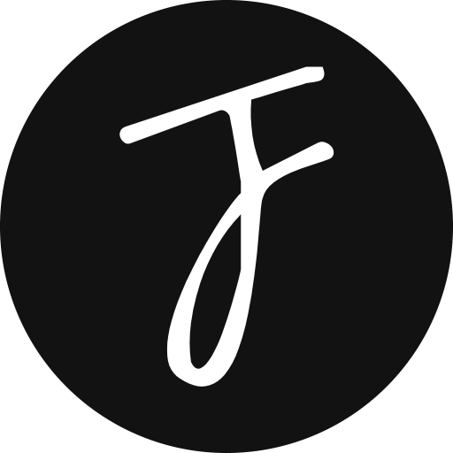

<div id="top"></div>
<br/>
<div align="center">
  <a href="https://github.com/fransjesky/sinclair">
    
  </a>
  <h1>Project Sinclair</h1>
  <p align="center">
  Welcome to the <strong>Project Sinclair</strong>.
    <br />
    <a href="https://jesky.dev">Live Website</a>
    ·
    <a href="https://github.com/fransjesky/sinclair/issues">Report Bug</a>
  </p>

[](https://github.com/fransjesky)
[](https://github.com/fransjesky/sinclair/LICENSE)
[](https://github.com/fransjesky/sinclair/releases)

</div>

### What is Project Sinclair?

I have been a gamer almost my whole life. Every time i play games, i always use the name **Sinclair** as my nickname. That is why i chose the name Sinclair for this project's name.

In 2020, i created my first portfolio website. It was quite good, but i never finished it. I was thinking of continuing or revamping it a few times. However, as my skills improved from time to time, i decided it was better to just start over from scratch.

As being said, that is the story behind project sinclair. It is a project to create my new immersive and breathtaking personal portfolio website.

## Getting Started 🚀


This project is built on **Node v18**, so make sure you have Node v18.x or above installed on your device. As this project uses the **NPM Package Manager**, please make sure to use npm as well to avoid any issue.

As you may already know, please run this command on your terminal after you cloned or forked the project to start the project's development server.

```sh
cd ~/desktop/sinclair       # if you clone the project on desktop
npm install                 # install all dependencies
npm run dev                 # start the development server
```

This project is using [Storybook](https://storybook.js.org/) as its component documentation. If you want to try the components or read more detailed documentation of this project, run this command below on your terminal.

```sh
npm run storybook           # start storybook server
```

### Contribution 🔥

At first, i wanted to keep this project private. However, i changed my mind and decided to make it public. There are some reasons behind it:

I never think my code is clean and perfect. It would be great if other people could help me find any bugs, errors, or even give suggestions by **opening an issue** or a **pull request**.

Being able to be helpful or inspiring is one of the most wonderful feelings in life. That is why i decided to make this project public, hoping someone out there could be helped or inspired by it.

### Supports ❤️

If you found useful things or got some inspiration from my project and you implemented it on your own project, i would love to hear or see it. Feel free to contact me by email, Discord or mention me on Twitter [@fransjesky](https://twitter.com/fransjesky).

Giving a star on github's repository takes less than a second, but it would mean a whole world to me. If you like this project, giving me a ⭐️ would be much appreciated.

If you want to treat me, just a cup of cappucino with single expresso would be more than enough 😋

[](https://www.buymeacoffee.com/fransjesky26)

<p align="right">( <a href="#top">back to top</a> )</p>

## License ⚖️

Copyright © 2023 by [Frans Jesky](https://github.com/fransjesky)

**Project Sinclair** is available and distributed under the [MIT License](https://github.com/fransjesky/sinclair/LICENSE).

### Code of Conduct

You are allowed to distribute, modify the codes, or use this project for personal use. However, i'd appreciate being credited as the author of the project or website.

If you want to make it commercial, you must ask for my permission, as i'm working on this project with a non-negligible amount of effort, experiences, knowledge and time.

There is a thin line between getting influenced or inspired and duplicating or plagiarizing. I want people to learn from and adapt from this project and later modify it to make it their own.

**NEVER CLAIM** all of my work or effort as your own!
<br/>
I never give permission to publish or present any of my projects as your own.

<p align="right">( <a href="#top">back to top</a> )</p>
